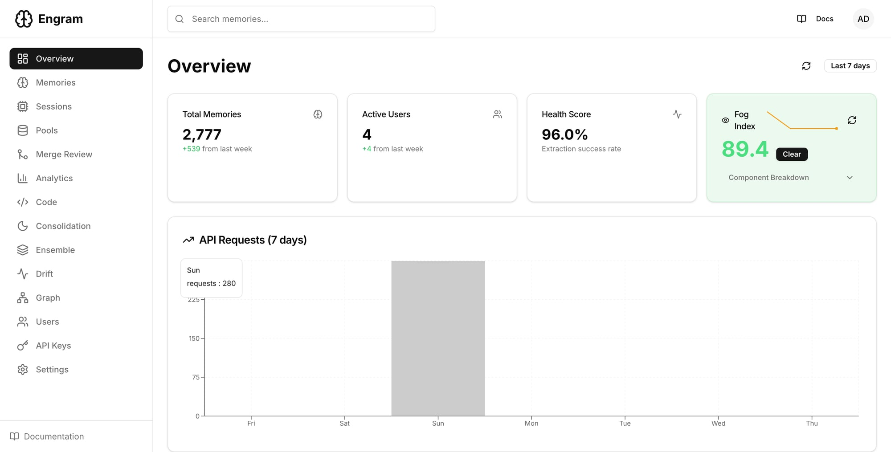
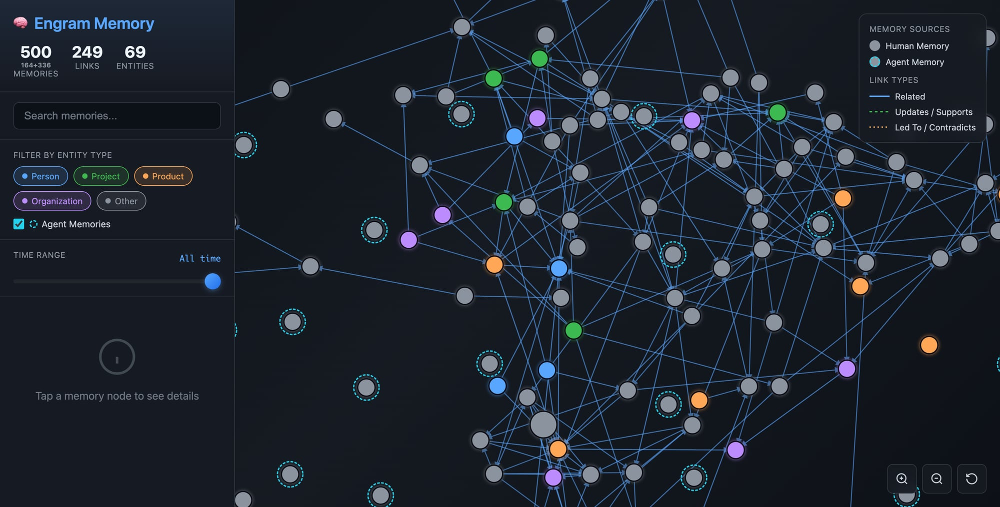
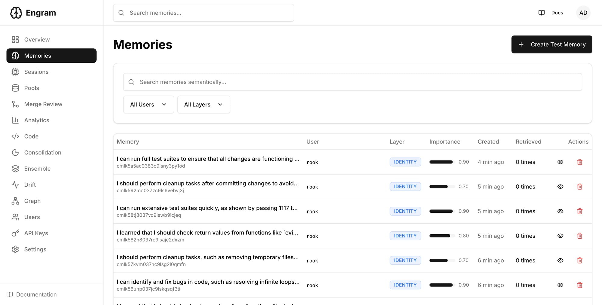

<p align="center">
  
  <h1 align="center">Engram</h1>
  <p align="center"><strong>Memory infrastructure for AI agents that actually works.</strong></p>
  <p align="center">
    <a href="https://github.com/heybeaux/engram/actions"></a>
    <a href="https://github.com/heybeaux/engram/blob/main/LICENSE"></a>
    <a href="https://github.com/heybeaux/engram/releases"></a>
    <a href="https://github.com/heybeaux/engram"></a>
  </p>
  <p align="center">
    <a href="https://github.com/heybeaux/engram">Core API</a> •
    <a href="https://github.com/heybeaux/engram-dashboard">Dashboard</a> •
    <a href="https://github.com/heybeaux/engram-embed">Local Embeddings</a> •
    <a href="https://github.com/heybeaux/engram/blob/main/docs/API.md">API Docs</a>
  </p>
</p>

---

> An **engram** is a hypothetical permanent change in the brain accounting for the existence of memory — a memory trace.

## What is Engram?

Every AI agent wakes up blank. It doesn't remember your name, your allergies, your preferences, or what you were working on yesterday. Most "memory" solutions bolt vector search onto chat history and call it a day. That's not memory — that's ctrl+F.

Engram is real memory infrastructure. It extracts structured knowledge from conversations, classifies it by type (facts, preferences, constraints, tasks, events), scores it by importance, and consolidates it over time — like how your brain moves short-term memories into long-term storage while you sleep. Safety-critical information (allergies, medications, emergency contacts) is detected automatically and **never forgotten**.

Built in under two weeks by one developer who was tired of agents that can't remember what happened five minutes ago. Engram runs fully local — PostgreSQL for storage, pgvector for search, local Rust embeddings on Apple Silicon Metal GPU at zero cost — or connects to OpenAI, Anthropic, Ollama, or LM Studio. It's running in production right now with **2,777 memories**, 96% extraction success, sub-200ms latency, and an 89.4 Fog Index (Clear). **1,114 tests passing across 57 suites.** This isn't a prototype.

## Key Features

- 🧠 **Smart Extraction** — Auto-extracts 5W1H structure, types, importance, and confidence scores from raw text
- 🔒 **Safety-Critical Detection** — 16 patterns catch allergies, medications, DNR directives — never evicted from context
- 🎯 **Multi-Model Ensemble** — 4 embedding models (bge-base, minilm, nomic, gte-base) on Metal GPU with RRF fusion for better recall
- 🌙 **Dream Cycle** — 4-stage consolidation pipeline: dedup → staleness → patterns → report (inspired by sleep neuroscience)
- 🏊 **Memory Pools** — Scoped, shared memory spaces for multi-agent collaboration with grant-based access control
- 🌫️ **Fog Index** — 6-component cognitive health score that tells you how "clear" your agent's memory is
- ⏰ **Temporal Recall** — Understands "yesterday," "last week," "3 hours ago" — time-first, then semantic
- 🦀 **Local Embeddings** — Rust-powered [engram-embed](https://github.com/heybeaux/engram-embed) generates 768-dim vectors in ~10ms, $0 cost
- 📊 **Dashboard** — Next.js UI with memory browser, D3 graph visualization, ensemble status, and health monitoring
- 🔌 **Bring Your Own LLM** — OpenAI, Anthropic, Ollama, LM Studio — swap providers with one env var
- 📈 **Eval Framework** — 25 recall scenarios, latency benchmarks, regression detection built in
- 🛡️ **Production-Ready** — Rate limiting, advisory locks, daily backups, Swagger docs (120+ endpoints)

## Screenshots

<p align="center">
  <br />
  <em>Dashboard — Memory stats, Fog Index, API request volume, layer breakdown</em>
</p>

<p align="center">
  <br />
  <em>Knowledge Graph — Entities, relationships, and memory links visualized with D3</em>
</p>

<p align="center">
  <br />
  <em>Memory Browser — Semantic search, layer filtering, importance scores</em>
</p>

## Architecture

```
                    ┌──────────────────────────────────────────┐
                    │            Engram API (NestJS)           │
  ┌──────────┐     │                port 3001                 │     ┌─────────────────┐
  │  Your AI │────▶│  ┌────────────┐  ┌───────────────────┐  │────▶│   PostgreSQL     │
  │  Agent   │     │  │ Extraction │  │  Scoring & Decay   │  │     │   + pgvector     │
  │          │◀────│  │  Pipeline  │  │  Engine            │  │     │   port 5432      │
  └──────────┘     │  └────────────┘  └───────────────────┘  │     └─────────────────┘
                    │  ┌────────────┐  ┌───────────────────┐  │
                    │  │  Temporal  │  │  Safety-Critical   │  │     ┌─────────────────┐
                    │  │  Parser    │  │  Detector          │  │────▶│  engram-embed    │
                    │  └────────────┘  └───────────────────┘  │     │  (Rust/Candle)   │
                    │  ┌────────────┐  ┌───────────────────┐  │     │  port 8080       │
                    │  │  Dream     │  │  Memory Pools &    │  │     └─────────────────┘
                    │  │  Cycle     │  │  Multi-Agent       │  │
                    │  └────────────┘  └───────────────────┘  │     ┌─────────────────┐
                    └──────────────────────────────────────────┘     │  LLM Provider   │
                                   │                           ────▶│  (OpenAI/Claude/ │
                    ┌──────────────────────────────────────────┐     │  Ollama/LMStudio)│
                    │          Dashboard (Next.js)             │     └─────────────────┘
                    │              port 3000                    │
                    └──────────────────────────────────────────┘
```

## Quick Start

### Docker Compose (recommended)

The fastest way to get everything running:

```bash
git clone https://github.com/heybeaux/engram.git
cd engram

# Configure
cp .env.example .env
# Edit .env — at minimum set POSTGRES_PASSWORD and OPENAI_API_KEY (or use Ollama)

# Launch everything: API + PostgreSQL + engram-embed + Dashboard
docker compose up -d
```

That's it. Engram API at `localhost:3001`, Dashboard at `localhost:3000`.

### Manual Setup

```bash
git clone https://github.com/heybeaux/engram.git
cd engram

# Install dependencies
pnpm install

# Configure
cp .env.example .env
# Edit .env with your DATABASE_URL and LLM provider keys

# Run database migrations
pnpm prisma migrate deploy

# Start the server
pnpm start:dev
```

Server starts at `http://localhost:3001`. Verify with `curl http://localhost:3001/v1/health`.

### Fully Local (No Cloud APIs)

```bash
# Install Ollama
curl -fsSL https://ollama.com/install.sh | sh
ollama pull llama3.2
ollama pull nomic-embed-text

# In your .env:
LLM_PROVIDER=ollama
LLM_MODEL=llama3.2
EMBEDDING_PROVIDER=local        # uses engram-embed (Rust, free)
VECTOR_PROVIDER=pgvector
```

Zero data leaves your machine.

### Store Your First Memory

```bash
curl -X POST http://localhost:3001/v1/memories \
  -H "Content-Type: application/json" \
  -H "X-AM-API-Key: your-key" \
  -H "X-AM-User-ID: demo" \
  -d '{"raw": "I'\''m allergic to peanuts and I prefer dark mode"}'
```

Engram automatically extracts type (CONSTRAINT + PREFERENCE), scores importance, flags safety-critical content, generates embeddings, and links related memories.

### Recall

```bash
# Semantic search
curl -X POST http://localhost:3001/v1/memories/query \
  -H "Content-Type: application/json" \
  -H "X-AM-API-Key: your-key" \
  -H "X-AM-User-ID: demo" \
  -d '{"query": "any health concerns?", "limit": 5}'

# Temporal search
curl -X POST http://localhost:3001/v1/memories/query \
  -d '{"query": "what did we discuss yesterday?", "limit": 10}'

# Generate context for system prompt injection
curl -X POST http://localhost:3001/v1/context \
  -d '{"maxTokens": 4000}'
```

## Configuration

Copy `.env.example` to `.env` — it's fully documented. Key variables:

| Variable | Description | Default |
|----------|-------------|---------|
| `DATABASE_URL` | PostgreSQL connection string | *required* |
| `LLM_PROVIDER` | Chat/extraction: `openai`, `anthropic`, `ollama`, `lmstudio` | `openai` |
| `EMBEDDING_PROVIDER` | Embeddings: `openai`, `ollama`, `local` | `openai` |
| `VECTOR_PROVIDER` | Vector store: `pgvector`, `pinecone` | `pgvector` |
| `ENSEMBLE_ENABLED` | Multi-model ensemble search | `true` |
| `ENSEMBLE_MODELS` | Comma-separated model list | `bge-base,minilm,nomic,gte-base` |
| `LOCAL_EMBED_URL` | engram-embed server URL | `http://localhost:8080` |
| `PORT` | API server port | `3001` |

See [`.env.example`](.env.example) for the full list.

## API Overview

Engram exposes 120+ endpoints. Here are the ones you'll use most:

### Memories
| Method | Endpoint | Description |
|--------|----------|-------------|
| `POST` | `/v1/memories` | Store a memory |
| `PATCH` | `/v1/memories/:id` | Update a memory |
| `DELETE` | `/v1/memories/:id` | Soft-delete a memory |
| `POST` | `/v1/memories/query` | Semantic + temporal search |
| `POST` | `/v1/observe` | Auto-capture from conversation turns |
| `POST` | `/v1/context` | Generate context for system prompt |

### Search & Recall
| Method | Endpoint | Description |
|--------|----------|-------------|
| `POST` | `/ensemble/query` | Multi-model RRF fusion search |
| `POST` | `/v1/recall/contextual` | Topic-shift-aware contextual recall |
| `GET` | `/v1/memories/graph` | Graph data for visualization |

### Pools & Multi-Agent
| Method | Endpoint | Description |
|--------|----------|-------------|
| `POST` | `/v1/pools` | Create a memory pool |
| `GET` | `/v1/pools` | List pools |
| `POST` | `/v1/pools/:id/grant` | Grant agent access to pool |

### Consolidation
| Method | Endpoint | Description |
|--------|----------|-------------|
| `POST` | `/v1/consolidation/dream-cycle` | Run 4-stage Dream Cycle |
| `POST` | `/v1/consolidation/generate-context` | Generate MEMORY_CONTEXT.md |

### Monitoring
| Method | Endpoint | Description |
|--------|----------|-------------|
| `GET` | `/v1/health` | System health + metrics (no auth) |
| `GET` | `/v1/fog-index` | Cognitive health score |
| `GET` | `/v1/monitoring/status` | Detailed monitoring dashboard |
| `GET` | `/v1/monitoring/alerts` | Active alerts |
| `GET` | `/v1/eval/*` | Eval framework endpoints |

Full Swagger docs available at `/v1/docs` when the server is running.

## Dashboard

<!-- TODO: Add screenshot -->
<!--  -->

The [Engram Dashboard](https://github.com/heybeaux/engram-dashboard) is a Next.js app that gives you full visibility into your agent's memory:

- **Memory Browser** — Search, filter, inspect, and edit memories with full metadata
- **Graph Visualization** — Interactive D3 force-directed graph showing memory relationships, with effectiveScore sizing and safety-critical 🏥 badges
- **Ensemble Status** — See which embedding models are active, coverage stats, and A/B comparisons
- **Fog Index** — Real-time cognitive health dashboard — is your agent's memory sharp or getting foggy?
- **Pools & Sessions** — Manage multi-agent memory pools, view session contexts, memory attribution
- **Merge Candidates** — Review and bulk approve/reject/skip duplicate memory clusters
- **Health & Monitoring** — System metrics, alerts, Dream Cycle status

Runs on port 3000. Included in `docker compose up` or run separately from [engram-dashboard](https://github.com/heybeaux/engram-dashboard).

## Integration

### OpenClaw

Engram integrates with [OpenClaw](https://github.com/openclaw/openclaw) via workspace hooks for automatic memory capture:

- **`agent:bootstrap`** — Loads MEMORY_CONTEXT.md into the agent on startup
- **`message:received`** — Triggers contextual recall on topic shifts, injecting relevant memories
- **`message:sent`** — Captures agent observations and new knowledge

See the [OpenClaw Integration Guide](./docs/OPENCLAW_HOOK_INTEGRATION.md) for setup.

### Other Frameworks

Engram is a REST API — any agent framework can use it. A plugin system with adapters for LangChain, CrewAI, AutoGen, and others is coming in v2.0.

## Contributing

We'd love your help. See [CONTRIBUTING.md](./CONTRIBUTING.md) for dev environment setup and PR guidelines.

**High-impact areas:**
- Python SDK
- Integration guides (LangChain, AutoGen, CrewAI)
- New LLM/embedding providers
- Extraction quality improvements
- Documentation and examples

## Roadmap

Engram is at **v1.0.0** 🎉 — shipped February 2026. Here's what's next:

**v2.0 and beyond:**
- 🔌 **Plugin System** — Swap embedding providers, hook into any AI framework, pluggable storage backends
- 🕐 **Temporal Reasoning** — "What changed since last Tuesday?" with contradiction detection
- 🕸️ **Memory Graphs** — Typed relationship edges, graph traversal, causal chains
- 🌐 **Federated Memory** — CRDT-based sync between instances
- 🎤 **Voice & Multimodal** — Whisper transcription → auto-observe, image memories
- 👥 **Team Memory** — Multi-user pools with role-based access control

See [ROADMAP.md](./ROADMAP.md) for the full plan.

## License

[Apache License 2.0](./LICENSE)

## Authors

Built by [Beaux Walton](https://heybeaux.dev) and [Rook](https://github.com/heybeaux/engram) ♜ in Powell River, BC.

---

<p align="center">
  <em>Every agent deserves to remember.</em>
</p>
