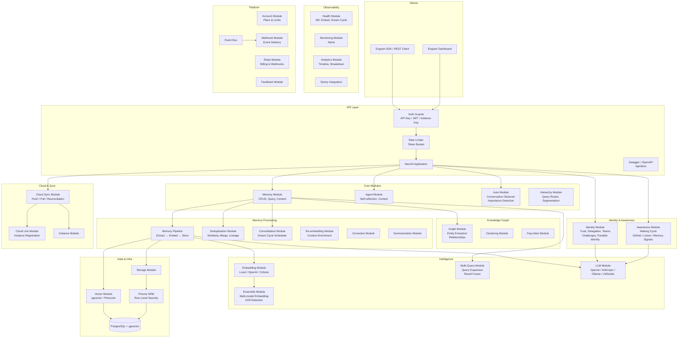
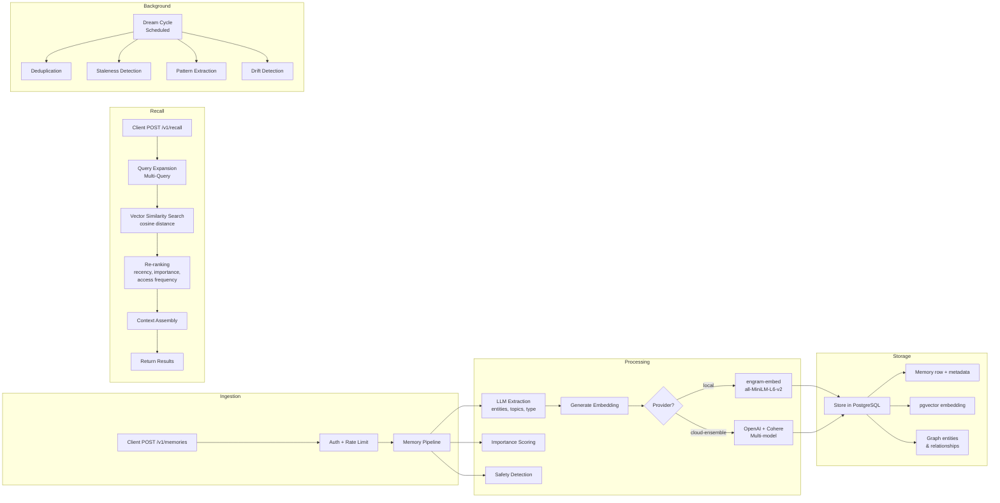
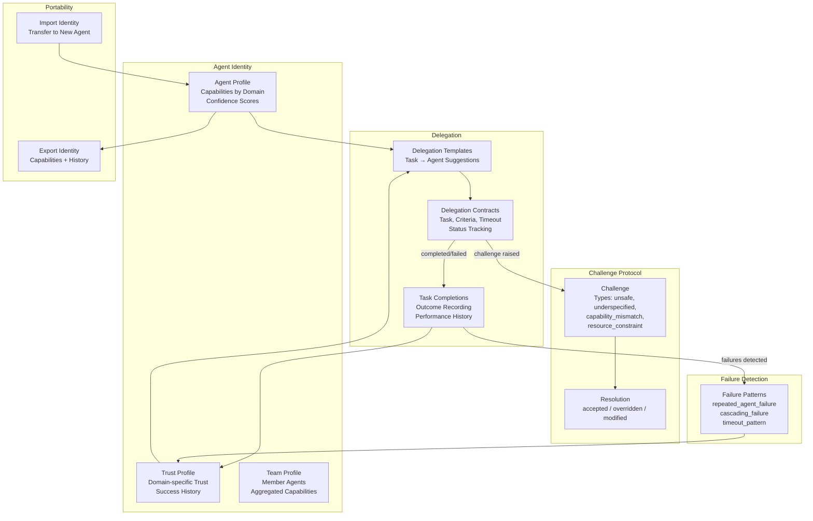
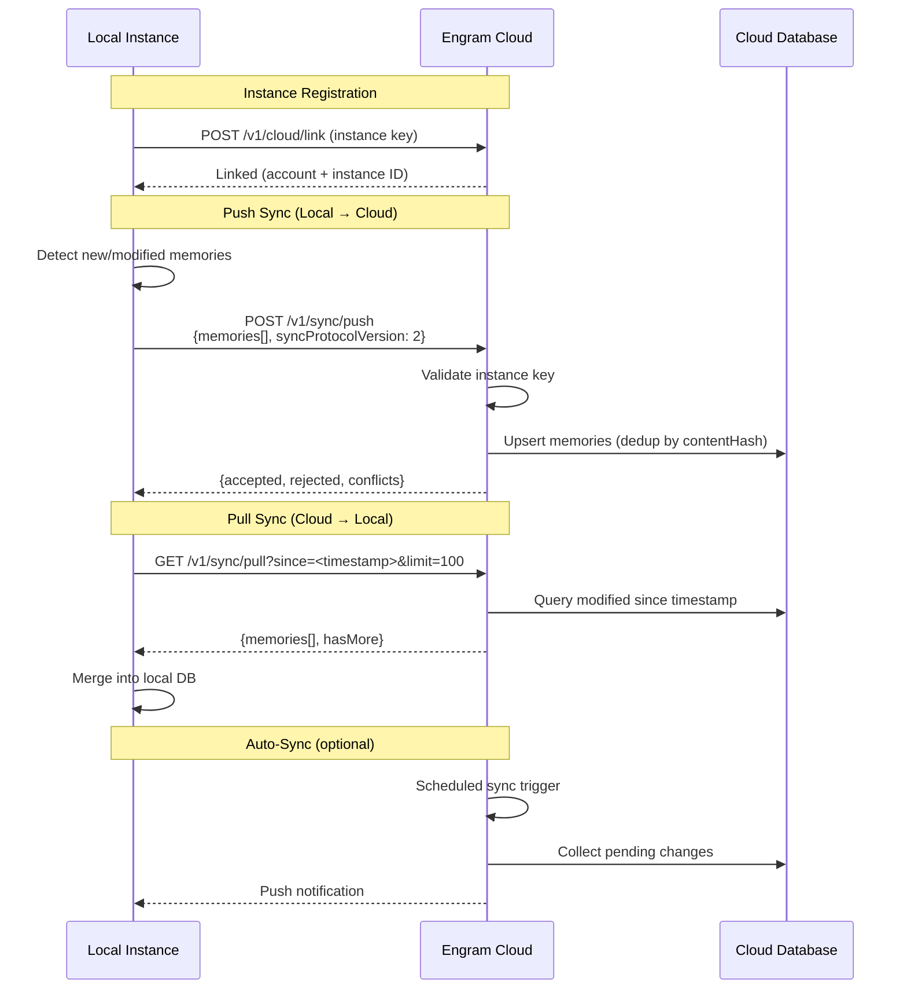

# Engram Architecture

## System Architecture

```mermaid
graph TB
    subgraph Clients
        SDK[Engram SDK / REST Client]
        Dashboard[Engram Dashboard]
    end

    subgraph API Layer
        Main[NestJS Application]
        Auth[Auth Guards<br/>API Key / JWT / Instance Key]
        RateLimit[Rate Limiter<br/>Token Bucket]
        Swagger[Swagger / OpenAPI<br/>/api/docs]
    end

    subgraph Core Modules
        Memory[Memory Module<br/>CRUD, Query, Context]
        Agent[Agent Module<br/>Self-reflection, Context]
        Auto[Auto Module<br/>Conversation Observer<br/>Importance Detection]
        Hierarchy[Hierarchy Module<br/>Query Router, Segmentation]
    end

    subgraph Intelligence
        Embedding[Embedding Module<br/>Local / OpenAI / Cohere]
        Ensemble[Ensemble Module<br/>Multi-model Embedding<br/>Drift Detection]
        MultiQuery[Multi-Query Module<br/>Query Expansion<br/>Result Fusion]
        LLM[LLM Module<br/>OpenAI / Anthropic / Ollama / LMStudio]
    end

    subgraph Memory Processing
        Pipeline[Memory Pipeline<br/>Extract → Embed → Store]
        Dedup[Deduplication Module<br/>Similarity, Merge, Lineage]
        Consolidation[Consolidation Module<br/>Dream Cycle Scheduler]
        Reembedding[Re-embedding Module<br/>Context Enrichment]
        Correction[Correction Module]
        Summarization[Summarization Module]
    end

    subgraph Knowledge Graph
        Graph[Graph Module<br/>Entity Extraction<br/>Relationships]
        Clustering[Clustering Module]
        FogIndex[Fog Index Module]
    end

    subgraph Identity & Awareness
        Identity[Identity Module<br/>Trust, Delegation, Teams<br/>Challenges, Portable Identity]
        Awareness[Awareness Module<br/>Waking Cycle<br/>GitHub / Linear / Memory Signals]
    end

    subgraph Cloud & Sync
        CloudSync[Cloud Sync Module<br/>Push / Pull / Reconciliation]
        CloudLink[Cloud Link Module<br/>Instance Registration]
        Instance[Instance Module]
    end

    subgraph Data & Infra
        Prisma[Prisma ORM<br/>Row-Level Security]
        PG[(PostgreSQL + pgvector)]
        Vector[Vector Module<br/>pgvector / Pinecone]
        Storage[Storage Module]
    end

    subgraph Observability
        Health[Health Module<br/>DB, Embed, Dream Cycle]
        Monitoring[Monitoring Module<br/>Alerts]
        Analytics[Analytics Module<br/>Timeline, Breakdown]
        Sentry[Sentry Integration]
    end

    subgraph Platform
        Account[Account Module<br/>Plans & Limits]
        Stripe[Stripe Module<br/>Billing & Webhooks]
        Webhooks[Webhook Module<br/>Event Delivery]
        Feedback[Feedback Module]
        Events[Event Bus]
    end

    SDK --> Auth
    Dashboard --> Auth
    Auth --> RateLimit
    RateLimit --> Main

    Main --> Memory
    Main --> Agent
    Main --> Auto
    Main --> Identity
    Main --> Awareness
    Main --> CloudSync

    Memory --> Pipeline
    Pipeline --> Embedding
    Pipeline --> LLM
    Pipeline --> Vector
    Pipeline --> Storage

    Memory --> MultiQuery
    Memory --> Dedup
    Memory --> Consolidation
    Memory --> Graph

    Identity --> LLM
    Awareness --> LLM

    Embedding --> Ensemble
    Vector --> PG
    Storage --> Prisma
    Prisma --> PG

    CloudSync --> CloudLink
    CloudSync --> Instance

    Events --> Webhooks
```

## Data Flow: Memory Lifecycle

```mermaid
flowchart LR
    subgraph Ingestion
        A[Client POST /v1/memories] --> B[Auth + Rate Limit]
        B --> C[Memory Pipeline]
    end

    subgraph Processing
        C --> D[LLM Extraction<br/>entities, topics, type]
        C --> E[Importance Scoring]
        C --> F[Safety Detection]
        D --> G[Generate Embedding]
        G --> G1{Provider?}
        G1 -->|local| G2[engram-embed<br/>all-MiniLM-L6-v2]
        G1 -->|cloud-ensemble| G3[OpenAI + Cohere<br/>Multi-model]
    end

    subgraph Storage
        G2 --> H[Store in PostgreSQL]
        G3 --> H
        H --> H1[Memory row + metadata]
        H --> H2[pgvector embedding]
        H --> H3[Graph entities<br/>& relationships]
    end

    subgraph Recall
        I[Client POST /v1/recall] --> J[Query Expansion<br/>Multi-Query]
        J --> K[Vector Similarity Search<br/>cosine distance]
        K --> L[Re-ranking<br/>recency, importance,<br/>access frequency]
        L --> M[Context Assembly]
        M --> N[Return Results]
    end

    subgraph Background
        O[Dream Cycle<br/>Scheduled] --> P[Deduplication]
        O --> Q[Staleness Detection]
        O --> R[Pattern Extraction]
        O --> S[Drift Detection]
    end
```

## Identity Framework

```mermaid
flowchart TB
    subgraph Agent Identity
        AP[Agent Profile<br/>Capabilities by Domain<br/>Confidence Scores]
        TP[Trust Profile<br/>Domain-specific Trust<br/>Success History]
        TM[Team Profile<br/>Member Agents<br/>Aggregated Capabilities]
    end

    subgraph Delegation
        DT[Delegation Templates<br/>Task → Agent Suggestions]
        DC[Delegation Contracts<br/>Task, Criteria, Timeout<br/>Status Tracking]
        TC[Task Completions<br/>Outcome Recording<br/>Performance History]
    end

    subgraph Challenge Protocol
        CH[Challenge<br/>Types: unsafe, underspecified,<br/>capability_mismatch,<br/>resource_constraint]
        CR[Resolution<br/>accepted / overridden / modified]
    end

    subgraph Failure Detection
        FP[Failure Patterns<br/>repeated_agent_failure<br/>cascading_failure<br/>timeout_pattern]
    end

    subgraph Portability
        EX[Export Identity<br/>Capabilities + History]
        IM[Import Identity<br/>Transfer to New Agent]
    end

    AP --> DT
    TP --> DT
    DT --> DC
    DC -->|completed/failed| TC
    TC --> TP
    DC -->|challenge raised| CH
    CH --> CR
    TC -->|failures detected| FP
    FP --> TP
    AP --> EX
    IM --> AP
```

## Cloud Sync

```mermaid
sequenceDiagram
    participant Local as Local Instance
    participant Cloud as Engram Cloud
    participant DB as Cloud Database

    Note over Local,Cloud: Instance Registration
    Local->>Cloud: POST /v1/cloud/link (instance key)
    Cloud-->>Local: Linked (account + instance ID)

    Note over Local,Cloud: Push Sync (Local → Cloud)
    Local->>Local: Detect new/modified memories
    Local->>Cloud: POST /v1/sync/push<br/>{memories[], syncProtocolVersion: 2}
    Cloud->>Cloud: Validate instance key
    Cloud->>DB: Upsert memories (dedup by contentHash)
    Cloud-->>Local: {accepted, rejected, conflicts}

    Note over Local,Cloud: Pull Sync (Cloud → Local)
    Local->>Cloud: GET /v1/sync/pull?since=<timestamp>&limit=100
    Cloud->>DB: Query modified since timestamp
    Cloud-->>Local: {memories[], hasMore}
    Local->>Local: Merge into local DB

    Note over Local,Cloud: Auto-Sync (optional)
    Cloud->>Cloud: Scheduled sync trigger
    Cloud->>DB: Collect pending changes
    Cloud-->>Local: Push notification
```
